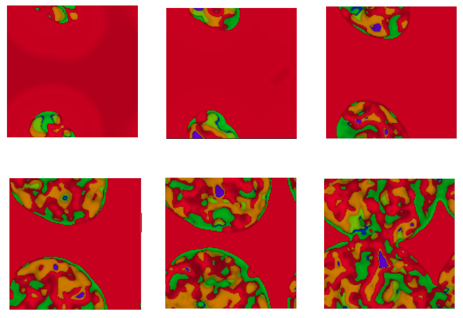
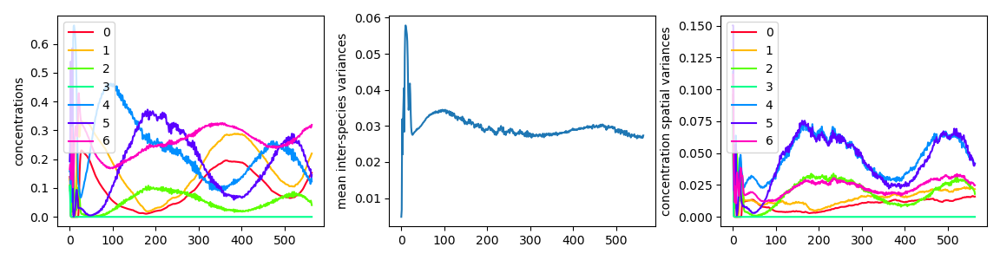

# Multi-Species-Reaction-Diffusion
A Python class for simulating reaction-diffusion models which generalize to any number of interacting `chemicals' / species. 

Includes a script for animating the system, showing different colours for where different species have the highest concentration at a given location, and the shade of colour reflects what this highest concentration value actually is.

The code makes use of scipy's optimized convolve function. Other requirements are numpy, matplotlib and tqdm. 





Reaction-diffusion equations describe the interactions between $N$ species with concentrations  $\mathbf{u}(\mathbf{x},t) = [ u_1(\mathbf{x},t),  ...,  u_N(\mathbf{x},t) ]$. Each $u_i(\mathbf{x},t) \in [0,1]$ represents a concentration of a given species at location $\mathbf{x}$ and time $t$.

The model is defined such that the concentrations of different species at a given location always sum to 1, i.e., 
$$\sum_{i=1}^{N} u_i(\mathbf{x},t) = 1$$

This is generally a neat property to maintain, but also I think it will be interesting to simulate some competitive evolution of the species parameters - hence improving the fitness of one species should always occur at the expense of other species' fitness. Therefore at every update iteration the concentrations at each point $\mathbf{x}$ are renormalized: $u_i(\mathbf{x},t) \rightarrow \frac{u_i(\mathbf{x},t)}{\Sigma_{j}^{N} u_j(\mathbf{x},t)}$ 

The system is modelled within a fixed area (periodic boundary conditions), hence this also implies the sum of all concentrations within the modelled area is just the size of the area.

The concentrations of each species changes over time:

```math
\frac{\partial u_i(\mathbf{x}, t)}{\partial t} = d_i \nabla^{2}u_i + u_i(\mathbf{x},t)(1 -u_i(\mathbf{x},t)) f_i(\mathbf{u}(\mathbf{x},t), \mathbf{w}^{(i)})
 
 = d_i \nabla^{2}u_i + u_i(\mathbf{x},t)(1 -u_i(\mathbf{x},t)) \sum_{j}^{N} w_j u_j(\mathbf{x},t)
```

Here, $\nabla^{2}$ is the laplacian operator, and its diffusion term is scaled by some value $d_i$. For now, all $d_i$ are set to the same constant value $d$.

The rightmost term is the reaction term, which specifies how species $i$ interacts with itself and the other species (hence $f_i$ is a function of all species, $[u_1(\mathbf{x},t), ..., u_N(\mathbf{x},t)]$). Each $f_i$ has its parameters $\mathbf{w}^{(i)}$ which specifying the behaviour, and one could attempt to fit or evolve these parameters with some algorithm.

The $u_i(\mathbf{x},t)(1 -u_i(\mathbf{x},t))$ is the logistic map function included to scale the reaction term. With $w_j \in [-1,1]$, it follows that $-1 \le f_i(\mathbf{u}, \mathbf{w}^{(i)}) \le  1$. Therefore the whole reaction term $u_i(\mathbf{x},t)(1 -u_i(\mathbf{x},t)) f_i(\mathbf{u}(\mathbf{x},t), \mathbf{w}^{(i)})$ is never larger than the difference $u_i$ is to the closest boundary of either 0 or 1.

However perhaps this scaling is not ideal -- or perhaps it's fine, but very small diffusion coefficients are needed match the reaction term values that are very small (in practise, far smaller than 1).
